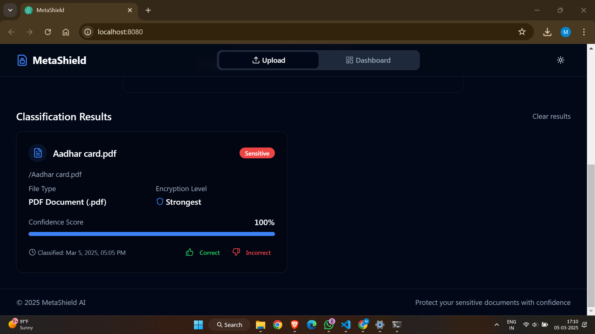

# AI-Powered Sensitive Document Classification Using Metadata
## Description
This project aims to build an AI-powered document classification system that determines whether a file is Sensitive (Y) or Non-Sensitive (N) using only metadata (without accessing the file's content). The model will provide a confidence score and apply encryption based on the sensitivity level. It will also incorporate self-learning capabilities, storing user feedback to improve accuracy over time.

## Features
* AI-based classification using only file metadata.
* Confidence scoring (e.g., 92%) for each classification.
* Stable classification (same file always receives the same result).
* Batch processing for multiple files at once.
* Encryption based on sensitivity level:
  *	>90%: Strongest encryption.
  * 80-90%: Moderate encryption.
  * <80%: Basic encryption.
* Interactive Web UI (React) for file uploads & classification.
* TensorFlow-based AI Model for classification processing.
* Support for multiple file types (PDF, Excel, Word, PNG, etc.).

## Installation & Running Instructions

**1. Clone the Repository**
git clone https://github.com/siddhi-khomane-developer/sensitivity-sleuth-ai.git
cd ai-sensitive-doc-classification

**2. Install Backend Dependencies**
cd backend
python3 -m venv venv
source venv/bin/activate  # On Windows: venv\Scripts\activate
pip install -r requirements.txt

**3. Install Frontend Dependencies**
cd ../frontend
npm install

**4. Run the Backend (TensorFlow Model API)**
cd backend
python app.py

**5. Run the Frontend (React UI)**
cd ../frontend
npm start
The application should now be running at http://localhost:8080/

## Modules & Functionality

**1. Backend (TensorFlow AI Model)**
*	TensorFlow-based Model: Uses metadata features to classify files.
*	Self-Learning System: Stores user feedback to improve predictions.
*	Batch Processing: Allows classification of multiple files at once.
*	Encryption Suggestion Module: Applies encryption based on sensitivity level.

**2. Frontend (React Web UI)**
*	File Upload Interface: Allows users to upload files for classification.
*	Classification Result Display: Shows file sensitivity, confidence score, and encryption level.
*	User Feedback System: Lets users correct misclassifications.
*	Dashboard: Displays history of past classifications.
*	Dark Mode & Animations: For a modern and user-friendly experience.

## Example Usage
**Using the Terminal (CLI API Call)**
You can use curl to classify a document by sending its metadata:

curl -X POST http://localhost:5000/classify -H "Content-Type: application/json" -d '{

"file_name": "pancard.pdf",

"file_extension": "pdf",
  
  "file_size": "medium",
  
  "file_type": "PAN card",
  
  "file_location": "/mnt/dev/pancard.pdf",
  
  "owner": "user123",
  
  "permissions": "read-write",
  
  "created_date": "2024-03-05",
  
  "modified_date": "2024-03-06"
  
}'

**Example Response:**
{
  "file_name": "/mnt/dev/pancard.pdf",
  "file_type": "PDF",
  "sensitivity": "Sensitive (Y)",
  "confidence_score": 95,
  "encryption_level": "Strong"
}

**Using the Web UI**
1.	Open http://localhost:8080/ in your browser.
2.	Upload a file.
3.	View classification results.
4.	Submit feedback if needed.

   
***Sensitive Files***

   
***Non-Sensitive Files***
   

## Future Enhancements
*	Improve AI model accuracy with more diverse training data.
*	Implement role-based access control (RBAC) for user permissions.
*	Extend encryption options with advanced security algorithms.
*	Add support for cloud storage integration (AWS S3, Google Drive, etc.).

